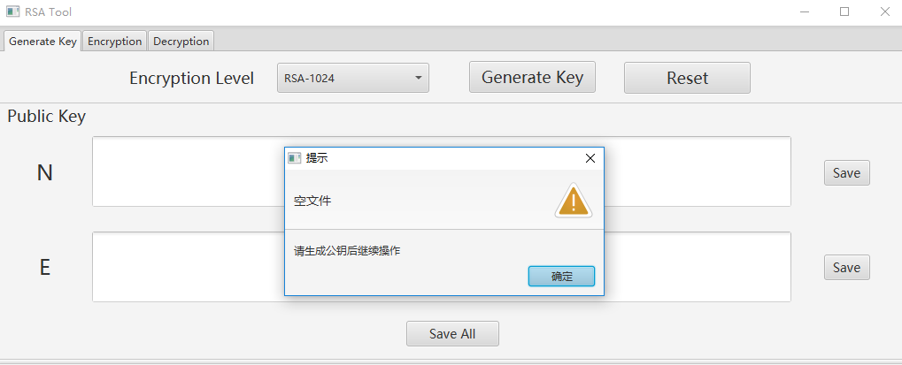
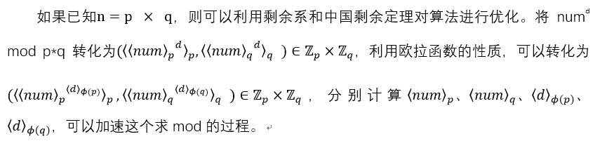

# DetailRsa
Detailed implementation of RSA algorithm.<br/>
RSA算法的详细实现，详细文档参见[这里](https://github.com/cuiods/DetailRsa/blob/master/doc/RSA%E5%AE%9E%E9%AA%8C%E6%8A%A5%E5%91%8A.pdf), 包括以下部分：
1. 大数的实现
2. 素数判定算法与素数的生成
3. 利用剩余系与中国剩余定理进行模算法的优化
4. 加解密字符串

## 0. 截图

### 1）生成密钥对
<br>
点击Generate Key可以生成公钥和私钥对，选择Encryption Level可以选择长度，长度包括256、512、768、1024、2048。点击Save可以选择密钥对的保存位置，点击Save All可以将公钥对或私钥对保存到程序当前目录下。<br/>



### 2）加密
<br/>
在加密页面，上一步生成的公钥会被自动填充到公钥栏，但是可以点击load选择其他文件中保存的公钥，在message框内输入需要加密的文本，点击Encrypt则可以进行文本加密。

### 3) 解密
<br/>
在解密步骤，程序会自动填入第一步中生成的密钥和第二步中生成的密文，点击Decrypt可以进行解密，也可以使用其他密文进行解密。点击save可以选择保存位置并保存。
<br/>


## 1. 大数的实现
实验要求不使用BigInteger类，但不可否认使用BigInteger类会更快。<br/>
参考原生BigInteger类的实现方式，简化版的BigInteger实现细节点击[这里](https://github.com/cuiods/DetailRsa/blob/master/src/main/java/com/cuiods/cryptology/rsa/integer/MyInteger.java)<br/>

使用10^9进制表示大数，使用二分法求解大数除法，使用欧几里得算法求模运算。


## 2. 素数判定

素数判定综合使用了数筛法、fermat测试和miller-rabin测试。算法的过程为：<br/>

1. 判断给定整数的位数n，如果n小于一个常数，则跳过数筛法测试，否则进行数筛法测试，没有通过返回false，否则继续下一步。
2. 为了提高效率，进行一次以2为底的Fermat测试，如果不通过，返回false，否则继续下一步。
3. 进行3次miller-rabin测试，如果不同，返回false，否则返回true

## 3. 模算法的优化

### 分治法优化a^b

大数运算中计算ab是不现实的，因此一般的想法是每两次乘法就进行一次mod运算，程序一共进行了Ο(n)次mod运算。然而，在计算ab时可以只计算x=a^(b/2) mod n，再计算x^2 mod n，利用递归，可以只进行Ο(lgn)次mod 运算

### 优化num^d mod p\*q


```Java
public static MyInteger speedUpMod(MyInteger num, MyInteger d, MyInteger p, MyInteger q) {
        //计算〈num〉_p 、〈num〉_q
        MyInteger numP = num.mod(p);
        MyInteger numQ = num.mod(q);
        
        //计算〈d〉_(ϕ(p)) 、〈d〉_(ϕ(q))
        MyInteger dP = d.mod(p.subtract(MyInteger.ONE));
        MyInteger dQ = d.mod(q.subtract(MyInteger.ONE));

        //使用第一步的分治法求指数mod n
        numP = speedUpMod(numP, dP, p);
        numQ = speedUpMod(numQ, dQ, q);

        MyInteger[] x = {numP, numQ};
        MyInteger[] m = {p,q};

        //使用中国剩余定理求解方程组
        return CrtResult(m, x);
}
```

## 4. 加解密字符串

将字符串理解为ASCII码的集合，每个字符可以用8位ASCII码来表示,可以将多个字符的二进制ASCII码拼接在一起，理解为一个整数，利用该整数进行加密，理论上可以维持加密后的长度不变。<br/>
解密时选取切割同样分组的字符串，恢复为大数，解密后形成一个二进制字符串，按每8位进行切割，形成一个8位ASCII码，仍然能还原为最开始的字符。

```Java
for (int i = 0; i <= message.length() / charNum; i++) {

//计算下一次字符串截取的位置，每次递增一个分组长度
//不能超过字符串的长度
    int maxLen = Math.min(i * charNum + charNum, message.length());
if (i * charNum < message.length()) {
    //按该长度截取密文的一段，这一段就是加密时的一个分组
        String hexStr = message.substring(i * charNum, maxLen);
        //恢复为大数进行mod运算
        MyInteger cInt = new MyInteger(StringConvert.convert(hexStr,16,10));
        MyInteger resultInt = SpeedUp.speedUpMod(cInt, D, P, Q);
        //运算后的结果恢复为二进制码
        StringBuilder resultStr = 
new StringBuilder(StringConvert.convert(resultInt.toString(),10,2));
        while (resultStr.length() % ASCII_BIT != 0)
            resultStr.insert(0, "0");
        String currentStr = resultStr.toString();
        //将二进制码每8位进行分割，恢复成字符
        for (int j = 0; j < currentStr.length(); j+=ASCII_BIT) {
            int c = Integer.parseInt(currentStr.substring(j, j+ASCII_BIT), 2);
            char cRes = (char) c;
            result.append(cRes);
        }
    } else break;
}

```
